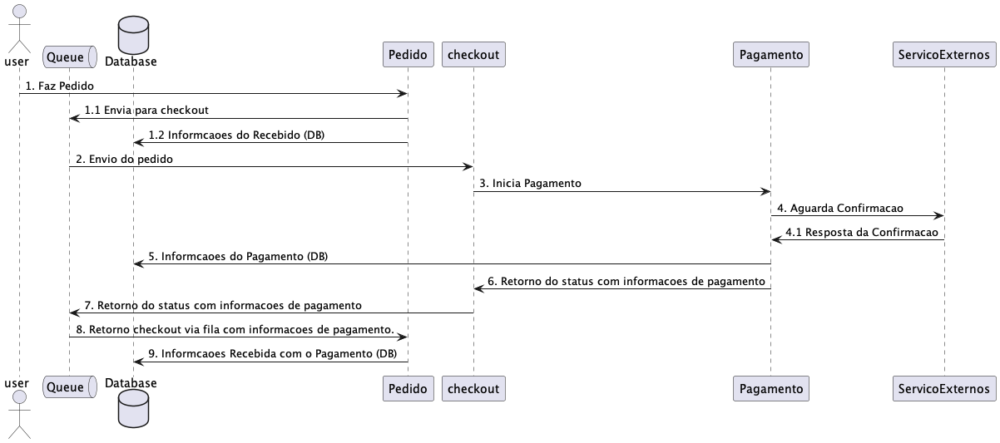

# Documento de Arquitetura de Software

## 1. Introdução

Neste documento, apresentamos a arquitetura de software de um sistema de pedidos de um restaurante, utilizando o padrões para gerenciar transações distribuídas. O padrão Saga é essencial para garantir a consistência e a compensação em sistemas distribuídos, onde diferentes serviços podem falhar independentemente. Este exemplo considera um fluxo de pedido de um restaurante, abrangendo as etapas de pedido, pagamento, chegada do pedido na cozinha e retirada pelo cliente

### 1.1 Visão Geral

Este documento descreve a arquitetura de software para um sistema de pedido de restaurante, utilizando o padroes para gerenciar transações distribuídas.

### 1.2 Objetivos

- Garantir a consistência dos dados através de transações distribuídas.
- Fornecer uma visão clara da arquitetura do sistema para desenvolvedores e stakeholders.

### 1.3 Escopo

O escopo deste documento inclui a descrição dos serviços, fluxo do pedido, e a implementação do padrão Saga.

## 2. Visão Geral do Sistema

O sistema de pedidos do restaurante é composto por vários componentes interconectados que gerenciam diferentes partes do processo de pedido. Os principais componentes incluem:

- Pedido: Responsável por capturar e armazenar os detalhes do pedido do cliente.
- Pagamento: Gerencia o processamento de pagamentos e integração com sistemas
  externos, como Mercado Livre.

### 2.1 Descrição do Sistema

O sistema é composto por vários microserviços que se via http e filas (SQS) que se comunicam para completar o fluxo de um pedido, incluindo etapas de pedido, pagamento, preparaçã e retirada para o cliente.

### 2.2 Requisitos de Alto Nível

- Criação e gestão de pedidos
- Processamento de pagamentos
- Preparação e atualização do estado do pedido
- Notificação ao cliente
- Retirada do pedido

### Diagrama de Arquitetura de Alto Nível

```css
Cliente -> [Sistema de Pedido] -> [Processamento de Pagamento] -> [Sistema de Pedido com Status]
                           \____________________/
                          [Integração com Sistema Externo]

```

### 2.3 Diagrama de Contexto

#### Pagamento Confirmado


<hr />

#### Pagamento Cancelado


## 3. Arquitetura do Sistema

### 3.1 Diagrama de Componentes

```
+---------------------+
| Sistema de Pedido   |
| +---------------+   |
| | Pedido        |   |
| +---------------+   |
+---------+-----------+
          |
          v
+---------------------+
| Processamento de    |
| Pagamento           |
| +---------------+   |
| | Pagamento     |   |
| +---------------+   |
+---------+-----------+
          |
          v
+---------------------+
| Integração com      |
| Sistema Externo     |
| +---------------+   |
| | MercadoLivre  |   |
| +---------------+   |
+---------+-----------+
          |
          v
+---------------------+
| Processamento de    |
| Pagamento           |
| +---------------+   |
| | Pagamento     |   |
| +---------------+   |
+---------+-----------+
          |
          v
+---------------------+
| Sistema de Pedido   |
| +---------------+   |
| | Pedido        |   |
| +---------------+   |
+---------+-----------+
          |
          v
+---------------------+
| Retirada            |
| +---------------+   |
| | Retirada      |   |
| +---------------+   |
+---------+-----------+
          |
          v
+---------------------+
| Cliente             |
+---------------------+

```

### 3.2 Descrição dos Componentes

#### 3.2.1 Serviço de Pedido

Responsável pela criação e gestão dos pedidos.

#### 3.2.2 Serviço de Pagamento

Processa os pagamentos dos pedidos.

#### 3.2.3 Serviço de Cozinha

Gerencia a preparação dos pedidos na cozinha.

#### 3.2.4 Serviço de Estoque

Verifica e reserva os itens do pedido.

#### 3.2.5 Serviço de Notificações

Notifica o cliente sobre o status do pedido.

#### 3.2.6 Serviço de Retirada do Pedido

Gerencia a retirada do pedido pelo cliente.

## 4. Fluxo de Processos com Saga Pattern

### 4.1 Descrição do Fluxo

1. **Pedido Criado**: Serviço de Pedido cria um novo pedido.
2. **Pagamento Processado**: Serviço de Pagamento processa o pagamento.
3. **Status Pedido**: Serviço de Notificações informa o cliente.
4. **Retirada do Pedido**: Serviço de Retirada do Pedido gerencia a entrega.

### 4.2 Diagrama de Sequência



### 4.3 Detalhes das Transações e Compensações

#### 4.3.1 Criação do Pedido

- Compensação: Cancelar o pedido e liberar os itens do estoque.

#### 4.3.2 Pagamento

- Compensação: Reembolsar o pagamento e cancelar o pedido.

#### 4.3.3 Preparação do Pedido

- Compensação: Marcar o pedido como "Falha na Preparação" e notificar o cliente.

#### 4.3.4 Retirada do Pedido

- Não requer compensação direta, mas notificações e rastreamentos são essenciais.

### Fluxo com o Padrao Saga


## 5. Detalhes Técnicos

### 5.1 Tecnologias Utilizadas

- Spring Boot
- MySQL

### 5.2 Estrutura dos Serviços

Cada serviço é um microserviço independente com seu próprio banco de dados.

### 5.3 Integração entre Serviços

A comunicação entre serviços é realizada através de mensagens assíncronas usando Kafka.

## 6. Considerações Finais

### Relatório dos processamentos do OWASP ZAP

- [pedido](out/OZAP/2024-08-08-ZAP-Report-Pedidos.html)
- [pagamento](out/OZAP/2024-08-08-ZAP-Report-Pagamentos.html)
- [producao](out/OZAP/2024-08-09-ZAP-Report-Producao.html)

### Benefícios da Implementação

A implementação do padrão Saga permite um gerenciamento robusto de transações distribuídas, garantindo que falhas parciais sejam tratadas de forma eficaz, mantendo a consistência do sistema e melhorando a experiência do usuário.

### Possíveis Melhorias Futuras

Futuras melhorias podem incluir a otimização dos processos de compensação e a integração com mais sistemas de pagamento externos.

## Autor

- **Nome:** Luciano Cordeiro Lessa
- **Email:** lucianoclessa@gmail.com

- **Nome:** Guilherme Luiz da Cunha
- **Email:** guilhermeldcunha@gmail.com

- **Nome:** Paulo Jean Alves da Silva
- **Email:** paulojean.alves@gmail.com

## Licença

Este projeto é licenciado sob a Licença MIT. Veja o arquivo [LICENSE](LICENSE) para mais detalhes.

## Agradecimentos

Agradecemos a todos que contribuíram direta ou indiretamente para a elaboração deste documento e para o desenvolvimento do sistema.
