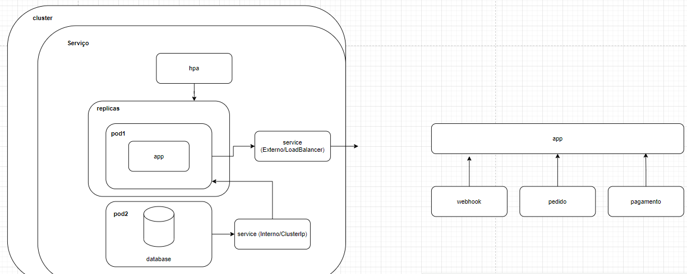

## Como inicializar o app

- **docker compose up -d**
- O app estará dsponível na porta 8080

## Endpoints
A Documentação dos endpoints foi realizada usando
**OpenApi 3.0**. Dessa forma, os endpoints, seus parâmetros e
descrições estão disponíveis em **http://localhost:8080/swagger-ui/index.html**.

## Arquitetura das apis
